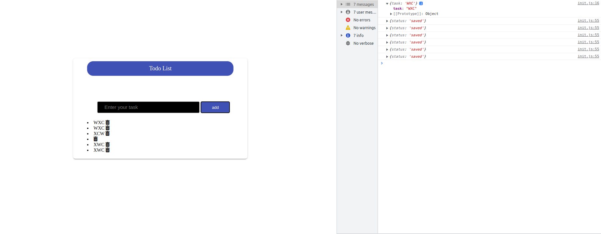
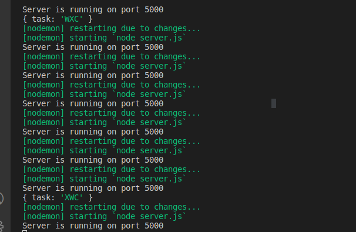
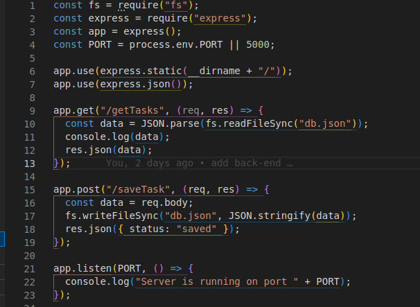

# todolist-app

After clone you need to install `npm` dependencies and then follow this steps.

Here are the steps you can follow to build a simple to-do list application that uses a JSON server to store the data:

1- First, create a new project directory and navigate into it in the terminal.

2- Next, you'll need to install the `json-server`package by running the command **npm install -g json-server**.

3- Create a file called `db.json` in the root of your project directory, and add some sample to-do data in the form of a JSON object. The data should have a structure like:

              {
               "todos": [
                   { "id": 1, "text": "Learn javascript", "completed": false },
                   { "id": 2, "text": "Build a todo app", "completed": false }
               ]
           }

4- Now, you can start the JSON server by running the command `json-server --watch db.json.`

- This will start the server on [http://localhost:3000/](http://localhost:3000/) and make the data in the `db.json` file available as a RESTful API.

5- Next, you'll need to create an HTML file and JavaScript file for your to-do list application. The HTML should include a form for creating new to-dos, and a list to display existing to-dos.

 6- In the **JavaScript** file, you'll need to use the Fetch API or a library like **Axios** to make HTTP requests to the JSON server to retrieve, add, update and delete to-dos.

**You can use the `GET` method to retrieve the list of to-dos from the server, and the POST method to add new to-dos to the list. You can use `PUT` to update to-do and DELETE method to delete it.**

 `which I did not use in my case yet put method and delete`

7- Once you have the basic functionality working, you can use `JavaScript` to add features like toggling the completed property of a to-do, editing existing to-dos, and filtering the list to show only completed or incomplete to-dos.

8- Finally, you can style your **application** with `CSS` to make it look more polished.
